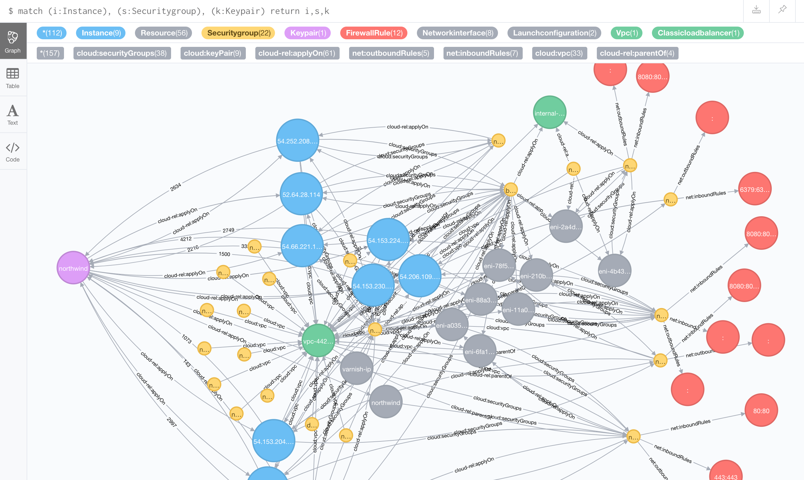

# AWS Infra Map
Load your AWS environment into a Neo4j DB

My [brief writeup on Medium](https://medium.com/@nick.p.doyle/using-neo4j-graph-database-to-map-your-aws-infrastructure-a81b1a49981b)

**Update May 2020** now based on neo4j 4.0

Components
- Neo4j
- [Awless](http://awless.io/) - for querying AWS and storing infra details in local [RDF](https://en.wikipedia.org/wiki/Resource_Description_Framework) files
- Python script [`awless_to_neo.py`](./awless_to_neo.py) to
  - Modify these RDF files so they won't choke neosemantics when it goes to load them into neo4j (mainly add :Labels to nodes without)
  - Load RDF files into Graph
  - Neaten Graph: .properties and :Labels, and set relationships e.g. route table associations
- [Neosemantics](https://neo4j.com/docs/labs/nsmntx/current/) - for loading RDF from awless into graph
- [APOC](https://neo4j.com/developer/neo4j-apoc/) - for powerful updating & querying of graph

# ToDo / Missing

- CloudWatch Event Rules - currently not supported in awless. Without this we don't get Lambda triggers
- Prob heaps of other stuff
- IAM assume roles

# Some Use Cases

Useful Interactively to
- Quickly understand what's running in an unfamiliar account
- Identify unused resources

## What are my s3 buckets, and which principals have what sort of access to them?
```
MATCH (s:Grant)
CALL apoc.path.subgraphNodes(s, {
    relationshipFilter: null,
    minLevel: 1,
    maxLevel: 3
})
YIELD node
RETURN node
```

# Usage

- `run.sh` will probably do what you want
- `run-docker-local-build.sh` will build docker image locally and run that

otherwise

```
docker run
    -d \
    --name aws_map_myaccount \
    --env NEO4J_AUTH=$NEO4J_AUTH \
    --env AWS_TO_NEO4J_LIMIT_REGION=ap-southeast-2  \
    --env AWS_SECRET_ACCESS_KEY=$AWS_SECRET_ACCESS_KEY \
    --env AWS_ACCESS_KEY_ID=$AWS_ACCESS_KEY_ID \
    --env AWS_SESSION_TOKEN=$AWS_SESSION_TOKEN \
    -p 7474:7474 \
    -p 7687:7687 \
    rdkls/aws_infra_map_neo4j
```


# Environment Variables
|Name|Format|Example|Purpose
|-|-|-|-|
| NEO4J_AUTH | user/pass | neo4j/happyjoe4u | Sets initial admin creds for neo4j
| AWS_DEFAULT_REGION | string | us-east-1 | DEFAULT AWS region  (note if AWS_TO_NEO4J_LIMIT_REGION is not set all regions will still be scanned)
| AWS_TO_NEO4J_LIMIT_REGION | string | us-east-1 | LIMIT to one AWS region (default is all)

The rest AWS_* are standard AWS auth credentials, used by awless to pull your config data

Note only read permissions are necessary (and recommended)

NEO4J_AUTH has format user/pass
and sets initial admin creds for neo4j

# Results



# Example run

```
mbp:~ nick - mocorp$ docker run -d     --name aws_mocorp_infra_map     --env AWS_SECRET_ACCESS_KEY=$AWS_SECRET_ACCESS_KEY     --env AWS_ACCESS_KEY_ID=$AWS_ACCESS_KEY_ID     --env AWS_SESSION_TOKEN=$AWS_SESSION_TOKEN          --env NEO4J_AUTH=$NEO4J_AUTH     -p 7474:7474     -p 7687:7687   --env AWS_DEFAULT_REGION=ap-southeast-2  rdkls/aws_infra_map
869f1634c1267e04ccb69f3cb3eed6c09779d4dcd0e1ade5c73a4e17106a40cf
mbp:~ nick - mocorp$ docker logs -f aws_mocorp_infra_map

Changed password for user 'neo4j'.
Directories in use:
  home:         /var/lib/neo4j
  config:       /var/lib/neo4j/conf
  logs:         /var/lib/neo4j/logs
  plugins:      /var/lib/neo4j/plugins
  import:       /var/lib/neo4j/import
  data:         /var/lib/neo4j/data
  certificates: /var/lib/neo4j/certificates
  run:          /var/lib/neo4j/run
Starting Neo4j.
2020-05-06 15:40:35.196+0000 WARN  Use of deprecated setting dbms.connectors.default_listen_address. It is replaced by dbms.default_listen_address
2020-05-06 15:40:35.198+0000 WARN  Use of deprecated setting port propagation. port 7687 is migrated from dbms.connector.bolt.listen_address to dbms.connector.bolt.advertised_address.
2020-05-06 15:40:35.199+0000 WARN  Use of deprecated setting port propagation. port 7474 is migrated from dbms.connector.http.listen_address to dbms.connector.http.advertised_address.
2020-05-06 15:40:35.200+0000 WARN  Use of deprecated setting port propagation. port 7473 is migrated from dbms.connector.https.listen_address to dbms.connector.https.advertised_address.
2020-05-06 15:40:35.200+0000 WARN  Unrecognized setting. No declared setting with name: HOME
2020-05-06 15:40:35.200+0000 WARN  Unrecognized setting. No declared setting with name: AUTH
2020-05-06 15:40:35.200+0000 WARN  Unrecognized setting. No declared setting with name: EDITION
2020-05-06 15:40:35.201+0000 WARN  Unrecognized setting. No declared setting with name: wrapper.java.additional
2020-05-06 15:40:35.206+0000 INFO  ======== Neo4j 4.0.0 ========
2020-05-06 15:40:35.210+0000 INFO  Starting...
waiting for neo4j to start ...
waiting for neo4j to start ...
SLF4J: Failed to load class "org.slf4j.impl.StaticLoggerBinder".
SLF4J: Defaulting to no-operation (NOP) logger implementation
SLF4J: See http://www.slf4j.org/codes.html#StaticLoggerBinder for further details.
waiting for neo4j to start ...
waiting for neo4j to start ...
waiting for neo4j to start ...
waiting for neo4j to start ...
waiting for neo4j to start ...
waiting for neo4j to start ...
waiting for neo4j to start ...
waiting for neo4j to start ...
waiting for neo4j to start ...
waiting for neo4j to start ...
waiting for neo4j to start ...
2020-05-06 15:40:48.039+0000 INFO  Called db.clearQueryCaches(): Query cache already empty.
2020-05-06 15:40:48.149+0000 INFO  Bolt enabled on 0.0.0.0:7687.
2020-05-06 15:40:48.149+0000 INFO  Started.
waiting for neo4j to start ...
2020-05-06 15:40:49.025+0000 INFO  Remote interface available at http://localhost:7474/
waiting for neo4j to start ...
awless sync for region ap-southeast-2

 █████╗  ██╗    ██╗ ██╗     ██████  ██████╗ ██████╗
██╔══██╗ ██║    ██║ ██║     ██╔══╝  ██╔═══╝ ██╔═══╝
███████║ ██║ █╗ ██║ ██║     ████╗   ██████  ██████
██╔══██║ ██║███╗██║ ██║     ██╔═╝       ██╗     ██╗
██║  ██║ ╚███╔███╔╝ ██████╗ ██████╗ ██████║ ██████║
╚═╝  ╚═╝  ╚══╝╚══╝  ╚═════╝ ╚═════╝ ╚═════╝ ╚═════╝

Welcome! Resolving environment data...

Found existing AWS region 'ap-southeast-2'. Setting it as your default region.

All done. Enjoy!
You can review and configure awless with `awless config`

Now running: `awless sync`
[info]    running sync for region 'ap-southeast-2'
[info]    -> lambda: 73 functions
[info]    -> dns: 13 zones, 0 record
[info]    -> storage: 0 s3object, 19 buckets
[info]    -> cdn: 0 distribution
[info]    -> access: 0 accesskey, 157 roles, 0 group, 1 mfadevice, 2 instanceprofiles, 37 policies, 0 user
[info]    -> infra: 0 image, 0 container, 0 containerinstance, 3 vpcs, 3 natgateways, 3 volumes, 15 targetgroups, 0 launchconfiguration, 25 certificates, 1 keypair, 0 snapshot, 198 networkinterfaces, 4 listeners, 0 scalingpolicy, 3 containerclusters, 139 securitygroups, 3 internetgateways, 0 classicloadbalancer, 15 loadbalancers, 0 database, 9 routetables, 3 availabilityzones, 3 elasticips, 3 instances, 0 importimagetask, 8 repositories, 131 containertasks, 12 subnets, 3 dbsubnetgroups, 0 scalinggroup
[info]    -> cloudformation: 0 stack
[info]    -> messaging: 31 queues, 40 subscriptions, 36 topics
[info]    sync took 7.500982132s

load file /var/lib/neo4j/import/ap-southeast-2-cloudformation.corrected.nt
No handlers could be found for logger "neo4j"
... loaded
load file /var/lib/neo4j/import/ap-southeast-2-infra.corrected.nt
... loaded
load file /var/lib/neo4j/import/ap-southeast-2-messaging.corrected.nt
... loaded
load file /var/lib/neo4j/import/ap-southeast-2-storage.corrected.nt
... loaded
load file /var/lib/neo4j/import/ap-southeast-2-lambda.corrected.nt
... loaded
<neo4j.DirectDriver object at 0x7f2f707fa190>
neo4j console
```

# Some Interesting Queries

Find everything related to your SNS subscriptions, within 3 degrees of separation
```
MATCH (s:Subscription)
CALL apoc.path.subgraphNodes(s, {
    relationshipFilter: null,
    minLevel: 1,
    maxLevel: 3
})
YIELD node
RETURN node
```
